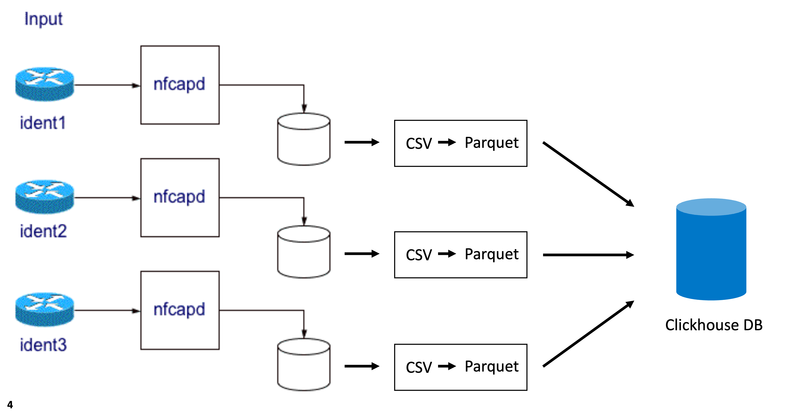

# nfdump2clickhouse

Tooling to insert [nfcapd](https://github.com/phaag/nfdump) files into a clickhouse database.

## Introduction
The [nfdump](https://github.com/phaag/nfdump) / [nfsen](https://github.com/phaag/nfsen) combination is widely used to collect (nfdump), analyze (nfdump) and visualize (nfsen) network traffic. 
Once setup properly it really helps network and/or security teams in their daily work. 
Nfsen provides a nice graphical view on network data and allows you to drill down in the data for analysis.

One drawback - at least if used for security analysis - is that it is very slow if you want to analyze historical data over longer periods of time. 
For example: if it turns out at some point that a specific IP address is connected to an 'evil actor', you would like to find out if there has been contact with that IP address over the past X days, weeks or even months. 

But analyzing historical data in those cases with a specific nfdump filter/profile is painfully slow, even with the newer (multi-threaded) version of the toolset. 
This is **not** because of a design flaw in nfdump, but simply because nfdump/nfsen combo was never designed with that specific use case in mind. The way it works is by aggregating and filtering data as it comes in and storing the results of those, ready for you to view and analyze.  

But if you *know* where to look (or better: *when*), then you can use nfdump to home in on that specific timeslice and use nfsen again to visualize/analyze further. Even if you then do need further filtering to drill down, the filtering will be that much quicker because the 'window' (amount of data to process) is already much much smaller!

The question then quickly becomes: is there a better way to hunt down appearances of specific IP address(es) in netflow data so that we can 'target' those time windows with nfdump? 

This of course is analogous to finding a needle in a haystack; which is exactly what an analytical database is designed to do: processing large volumes of data either for analysis or for finding specific occurrences. 
In order to do that you need to have the relevant data in an analytical database to start with, which is where nfdump2clickhouse comes in!

It is obvious from the name that [clickhouse](https://clickhouse.com/#getting_started) is the analytical database of choice. Simply because it is easy to install (or dockerize) on a fairly standard (but preferably big and powerful) VM or machine, without the need to setup and manage entire clusters; as some other big(gish) data 'solutions' will have you do (which seems rather silly and over the top if the only goal is to be able to pinpoint timeframes for further analysis). 

## What it does

**nfdump2clickhouse converts raw flow data (nfcapd files) as they come in, into parquet files and inserts those into clickhouse.**  
Just the raw data without aggregation or filtering. No more, no less. That is it. 

The image below (adapted from a [paper describing the principe of operation of nfdump tools](https://www.first.org/resources/papers/conference2006/haag-peter-papers.pdf)), shows the relationship between nfdump/nfcapd, nfdump2clickhouse and clickhouse:

* **nfcapd** receives the netflow input streams from the various sources (*ident1* through *ident3* in the figure) and stores them on disk. It does this in a time based fashion by rotating and renaming the output file every  n minutes (typically 5 minutes) and renaming the output file with the time stamp (*YYYYMMddhhmm*) of the interval. So a file named **nfcapd.202305081205** contains data from the 8th of May 2023 12:05 onwards (for 5 minutes, so data until 12:09:59).

* **nfdump2clickhouse** watches the directories where the nfcapd files are stored for these rotations (renaming actions) and converts those freshly stored files. First to CSV format (using nfdump) and subsequently to parquet format. It then invokes the clickhouse-client to ingest the resulting parquet file into the clickhouse database.



Only the fields from the netflow records that are relevant for the goal are converted and ingested into clickhouse. These are listed below, with their data type in the clickhouse database:

| *name*  | *description*                                                                                     | *data type* |
|---------|---------------------------------------------------------------------------------------------------|-------------|
| ts      | Start time of the flow                                                                            | DateTime    |
| te      | End time of the flow                                                                              | DateTime    |
| sa      | Source IP address                                                                                 | String      |
| da      | Destination IP address                                                                            | String      |
| sp      | Source port                                                                                       | UInt16      |
| dp      | Destination port                                                                                  | UInt16      |
| pr      | Protocol (e.g. 'TCP' or 'UDP')                                                                    | String      |
| flg     | Flags (if pr is 'TCP')                                                                            | String      |
| ipkt    | Number of packets in this flow                                                                    | UInt64      |
| ibyt    | Number of bytes in this flow                                                                      | UInt64      |
| smk     | Source mask                                                                                       | UInt8       |
| dmk     | Destination mask                                                                                  | UInt8       |
| ra      | IP address of the router/network device that exported this flow information                       | String      |
| in      | Input interface number                                                                            | UInt16      |
| out     | Output interface number                                                                           | UInt16      |
| sas     | Source AS number                                                                                  | UInt16      |
| das     | Destination AS number                                                                             | UInt16      |
| exid    | Exporter id                                                                                       | UInt16      |
| flowsrc | Additional label added by nfdump2clickhouse. <br/>Can be set in the config file per flow exporter | String      |

Please be aware that since the conversion takes place directly from the nfcapd files stored (before any aggregation and/or filtering), this means that flows are 'one-sided'; so a connection between a webbrowser X and a webserver Y will show up as two flows: one with IP address and port of X as a source and those of Y as a destination, and one flow that covers the other way around. This is also why the *opkt* and *obyt* fields from netflow records aren't stored, since they will always be zero because of this.

In practice this is not a problem, since the purpose is to identify timeframes where communication with a malicious host has taken place. So if you know that some external IP address was abused as a C2 server in a specific timeframe (say last month), you can simply search for all source IP addresses of flows that have that IP address as a destination within the last month.    

### Storage requirements

To get a rough estimate of the amount of space you need to reserve, the rule of thumb is that 100 million flows take roughly 2GB of disk space (50 million flows/GB).

As an example: if your network produces 2 billion (2000 million) flows per day on average, and you want to store 90 days worth of flows, that would work out as (2000/100) x 2 x 90 = 3600GB (roughly 3.5TB, assume 4TB to be on the safe side)

### Caveats
Only works on linux. 

Tested on debian and ubuntu.

The way it is setup now means that the nfdump toolset and netflow data need to be on the same machine as nfdump2clickhouse. In practice this need not be a problem if your netflow machine is already big and beefy enough. 

If it needs to be on a separate machine, you can most likely change the invocation of 'clickhouse-client' to connect to a clickhouse database on another server. 

Alternatively you can use a tool such as [samplicator](https://github.com/sleinen/samplicator) to duplicate/reflect netflow stream(s) to multiple destinations, one to your normal setup and one to the new machine specifically for this purpose. Of course then the netflow data needs to be processed by nfdump on the new machine as well, but without the need to store/keep the historical netflow data.

# Setting up

## Requirements

nfdump toolchain installed

### Clickhouse
#### Server

The quickest, easiest and preferred way - if you have docker installed - is to spin up a clickhouse docker container by issuing a ``docker compose up -d`` command in this directory. The resulting clickhouse instance will have no password set, but it is only reachable from the localhost. It will also be automatically restarted after reboot.

If you really do want to install clickhouse directly on your machine, you can follow the [setup instructions](https://clickhouse.com/docs/en/install/#self-managed-install) at [clickhouse.com](https://clickhouse.com/) to setup a clickhouse server. Note that nfdump2clickhouse assumes that the default user can be used without password, so ensure this is the case **and** that clickhouse can only be reached from localhost!

#### Client
Follow the [instructions](https://clickhouse.com/docs/en/install/#available-installation-options) to install from DEB or RPM packages, but only install the client package (e.g. ``sudo apt-get install -y clickhouse-client``).

If you have the server (container) running, the client can be started with ``clickhouse-client`` and should connect to the clickhouse server automatically. 


#### Creating the database and table
Is done automatically by nfdump2clickhouse itself.

## nfdump2clickhouse

### Python virtual environment
Create a Python virtual environment by issuing the following commands from the base directory of nfdump2clickhouse:
```
python3 -m venv venv
source venv/bin/activate
pip install -r requirements.txt
```
*Note: You might get an error message at the first step. In which case the venv python package is not installed yet. In that case install it first by doing:*
```commandline
sudo apt install python3-venv 
```
*Then follow the steps for creating the virtual environment again*

### Testing

Activate the virtual environment by running:
```commandline
source /venv/bin/activate
```

Executing nfdump2clickhouse.py without arguments gives the list of options
```c
./nfdump2clickhouse.py 

Error: No basedir provided. Provide either a basedir and parquetdir or a configuration file

usage: nfdump2clickhouse.py [-h] [-b basedir] [-d database.table] [-f flowsrc] [-c config file] [-l log file] [--debug] [-V]

Watches a directory (and its subdirectories) for nfcapd files and converts to parquet

Only files named 'nfcapd.YYYYMMDDHHMM' are picked up, thereby effectively ignoring 
files currently being generated by the nfdump tools.

options:
  -h, --help         show this help message and exit
  -b basedir         Base directory to watch for nfdump files
  -d database.table  Database and table to use, specified as <db>.<table>.
                     Default is test.testflows if not specified
  -f flowsrc         Additional flowsrc name stored in the flowsrc column
  -c config file     load config from this file. 
                     If a config file is specified then all
                     other command line options are ignored
  -l log file        Log to the specified file instead
                     of logging to console.
  --debug            show debug output
  -V, --version      print version and exit
```

The way of running nfdump2clickhouse in normal operation is as a service and with a config file, but for testing basic operation you can specify a (one) directory to watch from the command line, optionally providing a database and table and/or flowsrc name as well.
For basic testing simply provide a directory to watch (where nfcapd files are stored) from the command line, e.g.:

```
./nfdump2clickhouse.py -b /data/live/router1
```
This creates a test database (named 'test' appropriately) and a flows table called 'testflows'.
At the next rotation of nfdump, you should see logging appear that converts the new nfcapd file and inserts it into the database.  

Shut down nfdump2clickhouse by pressing Ctrl+C.

### Configuration
You need to specify the directories to watch and the database and table to use in the nfdump2clickhouse.conf file, see the .default example provided. e.g.:

```
[DEFAULT]
# By default watch.py logs to console.
# Specify a log file to log to file instead
logfile=/var/log/nfdump2clickhouse.log

# Default db.table to insert it into clickhouse
# Note you can specify different tables per watchdir!
# All created automatically
ch_table=nfsen.flows

# TTL in days, older flows are automatically removed
# Defaults to 90 if unspecified
#ch_ttl=45

[router1]
watchdir=watch
```
The name of the config section is used as the 'flowsrc' value for every flow ingested into the database from that watch. So in the above example, all flows coming from the ``watch`` directory will have a flowsrc value of 'router1'.

The default is to have one flows table where flows from all sources are stored. If you have a special use case for storing flows separately for each source, then you can specify a different database and table to use in each section.

By default flows are stored for 90 days. More specifically this means that all flows that have a 'te' value that is more than 90 days ago will be deleted automatically by clickhouse.
You can specify a different TTL by setting ch_ttl to a different value. This makes it easier to comply with GDPR requirements (only if you choose your TTL wisely of course). 

### Installing as service

Although you can start nfdump2clickhouse by hand, installing it as a service is preferred for normal operations as it ensures it is started automatically if you need to reboot.

Simply invoke the install script with sudo:
```
sudo ./install.sh
```

This will create the virtual environment if needed, and install and start the service.
You can ensure the service is running by checking the log file specified in the config file.

## Example queries

If you are familiar with SQL you should have no trouble querying the database for relevant data, for help and clickhouse SQL specifics you can consult their [documentation](https://clickhouse.com/docs/en/sql-reference).

Below are some example queries to get started. These assume you are using the relevant database ('nfsen' by default), which you can select in the clickhouse-client with ``` use nfsen; ```

*Find all flows starting after 2024-01-01 with a destination IP 1.2.3.4 and destination port 100:*

``` select * from flows where ts>'2024-01-01' and da='1.2.3.4' and dp=100;```

*Find all flows starting after 2024-01-01 coming from network 4.3.2.0/24, with destination IP 1.2.3.4 and destination port 100:*

``` select * from flows where ts>'2024-01-01' and isIPAddressInRange(sa, '4.3.2.0/24') and da='1.2.3.4' and dp=100;```

*Find all flows starting after 2024-01-01 with a destination IP either 1.2.3.4 or 10.11.12.13 and destination port 100:*

``` select * from flows where ts>'2024-01-01' and da in ('1.2.3.4', '10.11.12.13') and dp=100;```
